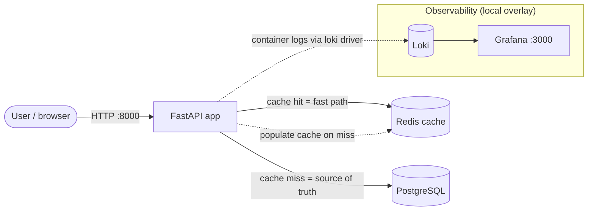

# Nimbus

DevOps end-to-end project: taking a small FastAPI URL shortener from "runs on
my machine" to a **containerized, automated, observable, and reproducible**
deployment.

[](https://github.com/vijaykumarcm1991/nimbus-project/actions/workflows/ci.yml)

Built as a portfolio piece following a DevOps take-home brief (containerization,
IaC, CI/CD, secrets handling, observability, rollback). Deliberate trade-offs
and known limitations are documented honestly in [NOTES.md](NOTES.md).

## Architecture



The lookup flow is a **cache-aside pattern**: check Redis first, fall back to
Postgres on a miss, populate the cache on the way out. `/health` verifies both
Postgres and Redis are reachable and is wired into the container healthchecks.

| Tier | Tech | Role |
|---|---|---|
| App | FastAPI + Uvicorn | Shorten URLs, redirect lookups, `/health` |
| Database | PostgreSQL 16 | Source of truth for code → URL mappings |
| Cache | Redis 7 | Fast lookups for hot codes (cache-aside) |

## Run it locally

Prerequisites: Docker Desktop (or any Docker + Compose v2), bash.

```bash
cp .env.example .env     # one-time: local dev config (gitignored, never committed)
docker compose up -d --build
```

Then open the interactive API docs at **http://localhost:8000/docs** — shorten
a URL with `POST /shorten`, look it up with `GET /links/{code}`.

`docker compose up` is the only command needed: Postgres and Redis start with
healthchecks, and the app waits for both to report **healthy** before booting
(`depends_on: condition: service_healthy`). Data persists across restarts in
the `db_data` volume. Verify with:

```bash
docker compose ps                          # all services (healthy)
curl -f http://localhost:8000/health       # {"status":"ok"}
```

## Observability (optional overlay)

One-time: install the Loki logging driver plugin.

```bash
docker plugin install grafana/loki-docker-driver:3.7.0-amd64 --alias loki --grant-all-permissions
```

Then run the base stack **plus** the observability overlay:

```bash
docker compose -f docker-compose.yml -f docker-compose.observability.yml up -d --build
```

All container logs ship to Loki; browse them in **Grafana → Explore**
(http://localhost:3000, no login). The overlay is a separate file so the base
compose — which CI runs — stays free of the plugin dependency.

## CI/CD

On every push to `main` (see [.github/workflows/ci.yml](.github/workflows/ci.yml)):

1. **Lint** with ruff — fast feedback, fails the run on errors
2. **Integration tests** with pytest against the real compose stack
   (tests gate everything downstream)
3. **Build & push** the image to GHCR, tagged with the commit SHA and `latest`

Only a green test run produces an image (`needs:` gate). Every image traces
back to the exact commit that built it — the foundation of rollback.

## Deploy

Deployment is deliberately **scripted and on-demand** rather than auto-deployed:
the staging environment is an ephemeral AWS sandbox, so there is no permanent
host to push to (reasoning in [NOTES.md](NOTES.md)).

```bash
./deploy.sh ghcr.io/vijaykumarcm1991/nimbus-project:<tag>
```

The script pulls that exact tested image, runs the full stack
(`docker-compose.deploy.yml`), and verifies `/health` before reporting success.

## Rollback

See [ROLLBACK.md](ROLLBACK.md). In short:

- **App rollback** = redeploy the last known-good SHA tag — the same command
  as a deploy, just with an older tag. Demonstrated and verified.
- **Data rollback** = `backup.sh` / `restore.sh` (pg_dump-based), with a
  documented disaster drill. Rolling back the app never touches data.

## Infrastructure as Code

[infra/](infra) contains Terraform for an ephemeral AWS staging environment:
VPC + subnet (network), EC2 t2.micro (compute), DynamoDB table (database).
Provisioned and destroyed on demand, one command each:

```bash
cd infra
terraform init      # once
terraform apply     # stand up staging
terraform destroy   # tear it all down
```

AWS credentials are supplied via environment variables in the shell session
only — never written to files or committed.

## Project structure

```
├── main.py                        # FastAPI app (shorten / lookup / health)
├── tests/test_api.py              # integration tests against the running stack
├── Dockerfile                     # slim base, non-root user, cached layers
├── docker-compose.yml             # 3-tier local stack + healthchecks
├── docker-compose.observability.yml  # Grafana + Loki overlay (opt-in)
├── docker-compose.deploy.yml      # runs pre-built registry images
├── deploy.sh / backup.sh / restore.sh
├── .github/workflows/ci.yml       # lint → test → build → push (GHCR)
├── infra/                         # Terraform staging environment
├── ROLLBACK.md                    # rollback strategy + disaster drill
└── NOTES.md                       # trade-offs, known limitations, postmortem
```

## Documentation

- [NOTES.md](NOTES.md) — postmortem-style: every deliberate trade-off, known
  limitation, and what I'd improve with more time/budget
- [ROLLBACK.md](ROLLBACK.md) — rollback strategy, worked example, disaster drill
